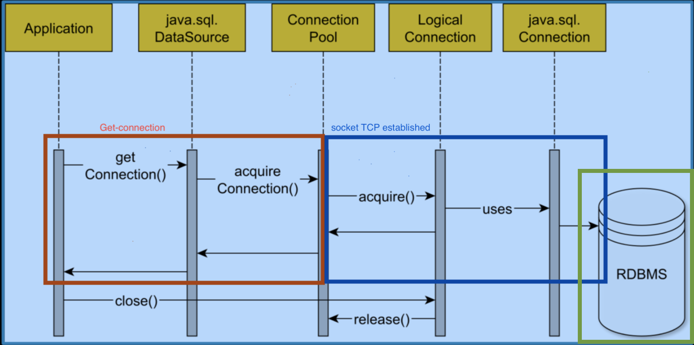
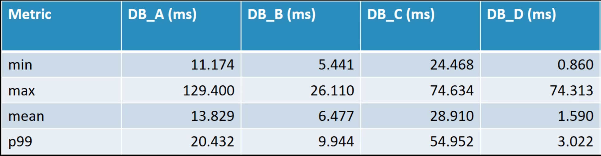
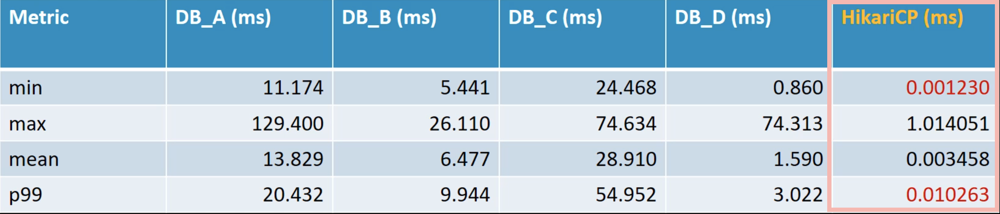
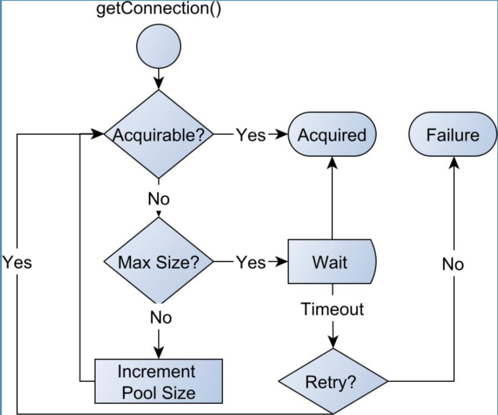
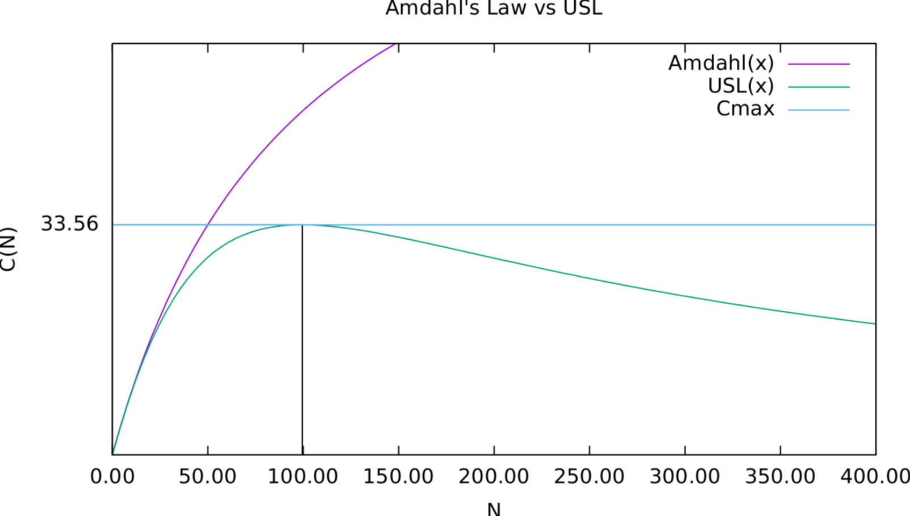
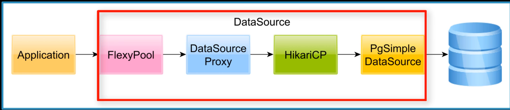

# JPA Connection Management

Initially the JPA 1.0 specification was very must tied to enterprise application servers.

In a Java EE container:
 
* all database connections are managed by the application server which provides:
    - connection pooling, 
    - monitoring 
    - JTA capabilities.  

* Connections are acquired via a JDBC DataSource that’s made available through JNDI.
Java Naming and Directory Interface API.


In the persistence.xml configuration file, the developer must supply:
 - JNDI name associated RESOURCE_LOCAL or JTA Datasource.
 - The transaction-type attribute must match the DataSource transaction capabilities. 


 
## RESOURCE_LOCAL Connection management

```xml
<persistence-unit name="persistenceUnit" transaction-type="RESOURCE_LOCAL"> 
    <provider>org.hibernate.jpa.HibernatePersistenceProvider</provider> 
    <non-jta-data-source>java:/comp/env/jdbc/hsqldb</non-jta-data-source> 
</persistence-unit>
```

RESOURCE-LOCAL stands for logical transactions that span on a single physical database transaction. 
From a JDBC perspective, the database transaction is acquired automatically when:
  * disabling auto-commit 
  or 
  * after ending the previous transaction
  
which is done by calling: commit or rollback on the JDBC Connection object. If we want to use RESOURCE_LOCAL transaction, this sniped xml example is how the persistence.xml is going to look like. Note that the transaction-type is set to RESOURCE_LOCAL and the non-jta-data-source is being used to declared which Java EE application server DataSource we would like to use.
   


## JTA Connection management

```xml
<persistence-unit name="persistenceUnit" transaction-type="JTA">
    <provider>org.hibernate.jpa.HibernatePersistenceProvider</provider> 
    <jta-data-source>java:global/jdbc/flexypool</jta-data-source> 
</persistence-unit>
```

JTA transaction can enlist multiple physical Database connections or even other XA-compatiblr resources like JMS queues. If we want to use JTA Transactions, the previous xml sniped is how the persistence.xml is going to look like.

We have two very important changes:

* that the Transaction-type is set with JTA.
* We have to use the jta-data-source xml element which must reference a JTA-compatible Java EE DataSource. 


## Driver-based Connection management

 * JPA 2.0 introduced JDBC Driver-based connection management.
 
| Property | Description |
|----------|--------------|
|javax.persistence.jdbc.driver | Driver full class name (e.g. org.hsqldb.jdbc.JDBCDriver ) |
| javax.persistence.jdbc.url | Driver Url (e.g. jdbc:hsqldb:mem:test ) |
| javax.persistence.jdbc.user |Database user’s name, used to establish the connection  |
| javax.persistence.jdbc.password | Database user’s password, the password of the current connection database user account  |


* These properties alone are not sufficient because most enterprise applications need connection pooling and monitoring capabilities anyway.
In reality, we need more than the database connection itself. we need:
 - connection-pooling capabilities.
 - connection-monitoring ( to gain an insight into application connection usage )

* For this reason, JPA connection management is still very much provider specific.

Although the connection management has been standardized, when it comes to performance, we need to know how the JPA provider handles the connection acquisition as well as the release.


### JDBC Connection lifecycle

The connection acquisition can influence the overall transaction response time. The JDBC DriverManager acts as a factory  of physical database connections.  

 > T = tAcquisition + tReq + tExec + Tres + tIdle
 
 
 
 
 
 1 - RED -> when the application tries to get a new connection from the Driver Then,
 
 2 - BLUE -> A Socket is open, and a TCP connection  is established  between the JDBC client and the database server.
 
 3 - GREEN -> On the database side, either a thread or a process is allocated to serve this particular connection. However, aprt from TCP handshake and the new thread or process begin allocated, establishing a connection 
 might incur client-side and server serve-side buffers to be allocated as well. For all these reasons we can conclude that **establishing a database connection is a resource intensive process.** with mush have a significant impact on the associated response time.
 
 ### Connection acquisition 
 
 if we take a four database products ans measure the connection acquisition time, we get the following results.
 


 
 when collecting metrics some developers make the mistake of considering only the average response time (line mean). However the average can level up traffic spikes. that does not mean that the average is meaningless, it means we need both the average and the percentiles (line p99). For instance, the 99 Percentile tells you that 99% of recorded values are below this particular percentile value. In our example if we take a interval between the minimum value and the 99 percentile, we can tell that the connection acquisition is in the millisecond range. 
 
For the third relation database (DB_C), the connection acquisition took up to 50 ms. that means the maximum throughput, for the a connection, is limited to only 20 transactions por secound. Therefore, for a high performance enterprise application, acquiring physical connections from the database can become a bottleneck.
 
### Connection acquisition using Connection pool 
If we measure the connection acquisition time when instead of using the JDBC DriverManager, we employ a connection pool. 
In this example we are using Hikari connection pool because it's open source, and probably the faster one available.



We can see that 99% of measurements (p99) are below 10 microseconds. Yeah....
that's three orders of magnitude faster that without using a connection-pool. Being so mush faster, the connection acquisition is no longer a bottleneck when trying to accommodate more transactions per second. 

In summury:

* When trying to acquire a connection from a pool, the overhead is mush more lower than for a physical database  connection. That is because pooled connections are reused over and over. So, acquiring a connection is just a matter of reserving it for the current requesting thread.
* Closing  the pooled connection is a lightweight operation as well, since the connection will go back to the pool while the underlying physical connection stays open.
 
 
### Pooled Connection acquisition



 
 1. When trying to acquire a connection, 
 2. if there's no connection available in the pool, the connection pool will check whether it cab grow its size.
 3. if the max pool size was not reached, the pool will grow, and the new connection is returned to the caller. But, if the max pool size was reached, the connection acquisition therad will block for a given amount of time and retry upon waking up. If there's still no connection available after the thread wakes up, a connection acquisition timeout exception will be throw.
 
 
 ## UNIVERSAL Scalability Law

Some util articles:

[UNIVERSAL Scalability Law ](https://tangowhisky37.github.io/PracticalPerformanceAnalyst/pages/spe_fundamentals/what_is_universal_scalability_law/)
 
 
Like CPU, memory or I/O bandwidth, database connections are limited.
After a given threshold, spanning more connections is only making matters worse.
The relation between capacity and the number of load generators, which is the number of connections in our case, is given by the Universal Scalability Law which is also a generalization of Amdahl's law.


 
* According to Amdahl's law, scalability is relative to the degree of parallelism a system can exhibit. But then, Amdahl's law places no upper limit on load generators, hence you might think that you could get infinite scalability  by just adding more connections.
 
* In reality, the more load generators, the more coordination is required, hence the coherency cost limits the amount of connections a system can use to yield maximum throughput. Therefore, not only that we gain better response time when using a connection pool, but we ensure that the number of connections is limited to an upper boundary.
 
* In case you have a rogue attacker running a Denial of Service attack against one of your front-end nodes, the traffic spike is not going to pass through to the database, being leveled up by the front-end application connection pool.
 
 * This way, only that particular node will get affected, leaving the rest of the system unharmed. If  instead, you let the whole traffic to go to the database, and the database has a hard limit on the maximum number of client connections.
 
 ----
 
 # Hibernate ConnectionProvider
 
 Hibernate needs to operate both in Java EE and stand-alone environments, and the database connection configuration can be done either declaratively or programmatically.
 
 * To accommodate both JDBC Driver connections as well as RESOURCE_LOCAL and JTA DataSource configurations, Hibernate defines its own connection factory abstraction via the ConnectionProvider interface.
 The ConnectionProvider acts as a contract between the Hibernate core and the actual connection management API.
 
```java
 
 public interface ConnectionProvider extends Service, Wrapped { 
    
    public Connection getConnection() throws SQLException;
    public void closeConnection(Connection connection) throws SQLException;
    public boolean supportsAggressiveRelease();
 }
 ```
 
 * The getConnection method is called whenever Hibernate requires a database connection. When releasing the connection, the close method of the ConnectionProvider will be called, passing the Connection reference that we previously acquired via the getConnection method call. The for DataSource-based connections, and we will discuss it when talking about connection acquisition and release modes.
 

 Hibernate offers multiple implementations for the ConnectionProvider interface:
 
  1. DriverManagerConnectionProvider
  2. C3P0ConnectionManager
  3. HikariConnectionProvider
  4. DataSourceConnectionProvider
 
Let's see how these four ConnectionProvider(s) work and which one is the best to use for a high-performance enterprise application.
 
 
### DriverManagerConnectionProvider

* Although it fetches database connections through the underlying DriverManager, this provider tries to avoid the connection acquisition overhead by using a trivial pooling implementation.

* The DriverManagerConnectionProvider is not meant to be used in a production setup. And if you try to use it, Hibernate is going to issue a warning message in the application log:

```log
HHH10001002: Using Hibernate built-in connection pool (not for production use!)
```
 
* This ConnectionProvider is useful for testing only. For instance, Hibernate uses it to avoid adding any extra library dependency into the core.
 

### C3P0 - C3P0ConnectionProvider

C3P0ConnectionProvider
• C3p0 is a mature connection pooling solution that has proven itself in many production environments.
• To use it, you need to provide the hibernate-c3p0 dependency.
 
``` xml
<dependency> 
    <groupId>org.hibernate</groupId> 
    <artifactId>hibernate-c3p0</artifactId> 
    <version>${hibernate.version}</version>
</dependency>
```

* To activate this provider, the application developer must supply at least one configuration property starting with the hibernate.c3p0 prefix. 
 
``` xml 
<property name="hibernate.c3p0.max_size" value="5"/>
```

* When encountering a c3p0 property, Hibernate is going to switch to using the C3P0ConnectionProvider.
* The rest of properties needed by the JDBC Driver like:
** Driver class name
** URL, 
** username
** password 
can be supplied via the JPA or Hibernate-specific Driver connection properties, which we saw previously when talking about JPA 2.0.
 

### Hikari - HikariConnectionProvider

Just like c3p0, Hibernate supports the Hikari connection pool natively, and the associated ConnectionProvider is embedded in the hibernate-hikaricp dependency.
 
``` xml
 <dependency> 
    <groupId>org.hibernate</groupId> 
    <artifactId>hibernate-hikaricp</artifactId> 
    <version>${hibernate.version}</version>
 </dependency>
```
 
 
 The Hikari ConnectionProvider does not recognize the Hibernate-specific or JPA Driver connection properties, so you need to use the Hikari-specific ones.
 
 ```
 hibernate.hikari.dataSourceClassName 
 hibernate.hikari.dataSource.url
 hibernate.hikari.dataSource.user
 hibernate.hikari.dataSource.password
 hibernate.hikari.maximumPoolSize
 ```
 
 
 
### DatasourceConnectionProvider 

* Unlike other providers, this one is compatible with JTA transactions, which are mandatory in Java EE.
* Spring works with both stand-alone JTA transaction managers (e.g. Bitronix or Atomikos) and non-JTA DataSource(s).
* Because it offers the best control over the actual DataSource configuration, the **DatasourceConnectionProvider** is the preferred choice (even for HikariCP)

 
If the previous ConnectionProvider(s) were JDBC Driver-based, operating with RESOURCE_LOCAL transactions only, the DatasourceConnectionProvider can work with either RESOURCE_LOCAL or JTA. Being more flexible, the DatasourceConnectionProvider is to be preferred.

**_Advantages:_**

* Supporting both RESOURCE_LOCAL and JTA transaction types,
 
* It allows you to chain as many DataSource proxies you want. For instance, you can choose any connection pool, even the ones that are not supported natively by Hibernate like Apache DBCP or Tomcat Connection Pool.
 
 

 
 
* You can also add the datasource-proxy logging framework so that you can print SQL statements along with their bind parameter values.
 
* You can use a Connection Pool monitoring tool, like FlexyPool. Therefore, it does not matter how many DataSource proxies are decorating the original JDBC DataSource, from Hibernate perspective, it's just a DataSource object reference.
 
