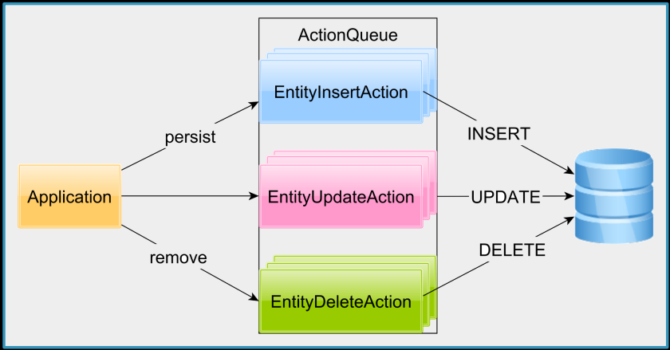

# Persistence Context

## Persistence Context Flush

TODO

## Action Queue

- Agenda
	
	- Events and EventsListerners
	- Action queue
	- Flush operation order

### Events and EventsListerners

Internally, each entity state change has an associated Hibernate Event:

- PersistEvent
- MergeEvent
- DeleteEvent

So, for persist we have the **PersistEvent**. For merge we have the **MergeEvent**. For JPA remove and the Hibernate delete operations we have the **DeleteEvent**, and so on.

Each Hibernate Event is handled by an associated event listener.

* The PersistEvent is handled by the DefaultPersistEventListener.
* The MergeEvent is handled by the DefaultMergeEventListener.
* The DeleteEvent is handled by the DefaultDeleteEventListener, and so on.

The Hibernate event listener mechanism allows the application developer to substitute the default event listeners with custom implementations.
For instance, this mechanism is used by Hibernate Envers to audit all entity modifications.

The Hibernate event listeners translate each entity state transition into an internal EntityAction that only gets executed at flush time.
Hibernate defines the following entity actions. When a transient entity becomes persistent, Hibernate generates either an EntitylnsertAction or an EntityldentitylnsertAction which triggers an SQL INSERT statement at flush time.

During flush, for every modified entity, an EntityUpdateAction is
generated which, when executed, triggers an SQL UPDATE statement.

When an entity is removed, Hibernate generates an EntityDeleteAction.
During flush, the associations marked with the orphan removal strategy can generate an **OrphanRemovalAction** if a child entity is dereferenced.

The EntityDeleteAction and the OrphanRemovalAction trigger a database SQL DELETE statement.

#### Flush Action Order:

Towards the end of the Persistence Context flush, when all entity
actions are in place, Hibernate executes them in a very strict order:

1. OrphanRemovalAction
2. EntityInsertAction and EntityIdentityInsertAction
3. EntityUpdateAction
4. CollectionRemoveAction
5. CollectionUpdateAction
6. CollectionRecreateAction
7. EntityDeleteAction

this is:
- First, the **OrphanRemovalAction** queue is executed. 
- Second, the **EntitylnsertAction** and **EntityldentitylnsertAction** queues will be executed.
- Afterward, the **EntityUpdateAction**, followed by **CollectionRemoveAction**, CollectionUpdateAction and **CollectionRecreateAction** queues will be executed.
-  The **EntityDeleteAction** queue is the last one to be executed.

### Testing Time:

To see the flush operation order in
practice, go to my hibernate-tunning GitHub repository and open the FlushOrderTest.

This test uses a Client entity that looks as follows.

- The Client entity has an identifier, a name and a slug property which is annotated with the **@NaturalId** Hibernate-specific annotation.

- The @NaturalId is used for business keys, and it allows you to fetch an entity by its natural identifier. Because a business key has to be unique, we are also defining a unique constraint for the slug table column.

- The init method is executed prior to every test execution, and it creates the following Client entity.

- The first test will fetch the previously persisted Client entity by its associated entity identifier.

- If we remove the entity and, afterward, we create a new one with the same slug value, we can expect that Hibernate is going to execute the DELETE first, and then the INSERT statement.

- However, when we run the testOperationOrder unit test, we can see that it fails with a ConstraintViolationException.

- The exception was triggered by the SLUG unique constraint which we have previously defined.

- If we inspect the output, we can see that the INSERT statement was executed first, and since there was already a Client table row with the same slug value, a ConstraintViolationException was thrown.

- This clearly demonstrates that, during flush, for a given entity type, the INSERT operations are always executed before DELETE statements. Therefore, the order of entity state transitions is the one defined by the Hibernate Action Queues, not the one declared by the application developer when writing the data access code.
 
**- To make sure that the DELETE statement is executed first, you can flush the Persistence Context** right after the remove method call, as you can see in the following test case.

When executing the c_testOperationOrderWithManualFlush unit test, we can see that the test passes successfully this time. If we go to the console, we can see that the DELETE statement is executed first since it was triggered by the manual flush. On the other hand, the INSERT statement is executed by the automatic
flush prior to committing the currently running transaction.

However, even if we fixed the issue, it does not mean that this is the right way to do it. We should not remove an entity only to add a new one back with the same business key or natural identifier.

It's more efficient to update the existing database table row, as you can see in the testUpdate unit test.  First, we unwrap the EntityManager to the Hibernate Session to get access to Hibernate-specific entity operations.

From the Hibernate Session, we can use the bySimpleNaturalld method to load the Client entity by its natural identifier. Afterward, we modify the entity title and let Hibernate generate the UPDATE statement at flush time. 
When running the testUpdate unit test, we can see that it passes successfully. And, if we check the console, there is a single UPDATE statement that gets executed.

###### Advantage of execute Update instead a Delete insert

There are multiple advantages of using the update instead of deleting the old entity and inserting a new one. 

1. the UPDATE is a single statement and, if you are using a secondary index for the natural identifier, the delete will have to remove the entry associated with the old row that got deleted, only to reinsert it back for the new table row. That's just a waste of database resources.

2. Second, by avoiding a manual flush, we could delay the connection acquisition even longer and reduce the transaction response time.

3. Third, by flushing only prior to committing the current transaction, Hibernate can better group multiple entities into a single batch operation. 

So, knowing the flush operation order is really important when using JPA and Hibernate. If you are getting a ConstraintViolationException because of the flush operation order, then there is a good chance that you are deleting and inserting instead of updating a given entity. By reducing the number of SQL statements that get executed as well as the number of times the Persistence Context is flushed, you can also reduce the overall
transaction response time.

