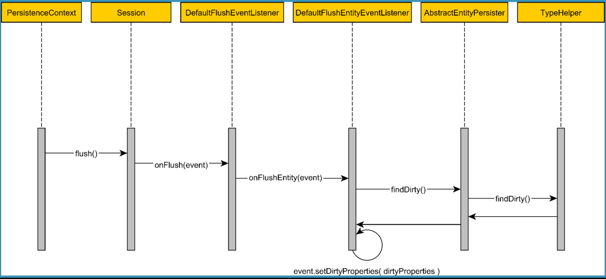

# Persistence-context - Dirty Checking 


- Hibernate default mechanism for checking entity modifications 
- Persistence Context size
- decribe the flush-clear-commit pattern (very useful when using the Persistence Context for batch processing)


## Dirty checking

* Whenever an entity state changes from **transient** to **managed**, Hibernate issues an **SQL INSERT statement**.

* When the entity is marked as **removed**, an **SQL DELETE statement** is issued.

* Unlike INSERT and DELETE, the SQL UPDATE statement does not have an associated entity state transition.

* When an entity becomes **managed**, the **Persistence Context** tracks its internal state and, during flush time, entity modifications are translated to **SQL UPDATE statements**.


# Hibernate default mechanism




1. when the **Persistence Context is flushed**, the hibernate session triggers a **FlushEvent** which is handler by the **DefaultFlushEventListener**.

2. In the **DefaultFlushEventListener** for every managed entity, a **FlushEntityEvent** is triggered which is handled by the **DefaultFlushEntityListener**.

3. In the **DefaultFlushEntityListener** calls the **findDirty** method on the associated **EntityPersister**, which is turn for every entity attribute, checks to see if the current property value is equals to the value that was loaded from the database when the entity was associated with the current Persistence Context.

4. In the end the dirty properties are set too the FlushEntityEvent as they are further used to the schedule the UPDATE statement (In the DefaultFlushEntityListener).

## Persistence Context size

The number of elements dirty checks is proportional to the number of entities multiplied by their properties.


Even if only one entity property changed, the Hibernate would still have to go through all managed entities in the current Persistence Context).


If the number of managed entities is fairly large the default dirty checking mechanism can have a significant impact on CPU resources.


```java
final Object[] loadedState = persister.hydrate( 
        resultSet, 
        id, 
        object, 
        rootPersister, 
        cols, 
        fetchAllPropertiesRequested, 
        session);
```
The default dirty checking mechanism relies on the loading-time state to compare the current entity attribute values with the ones fetched from the database. 

When fetch a entity from the database, the JDBC ResultSet is used by the EntityPersister to generate a Java Object array which stores all entity properties values. This Java Object array is called **loadedState** or **hydratedState**, and the operation of exacting the entity property value from JDBC ResultSet is called **hydration**, in Hibernate terminology.


```java
session.getPersistenceContext().addEntry(
    object,
    Status.LOADING,
    loadedState,
    rowId,
    id, version,
    lockMode, true,
    persister, false
);
```

After being created the **loadedState** java Object array is stored in the current Persistence Context along/as also the entity fetched from the database.


### Controlling  the Persistence Context size.

Since the entity loading-time state is held separately. The Persistence Context requires twice as mush memory to store a managed entity.

if the application developer does not need to update the selected entites, then it's much more efficient to fetch the entity in read-only mode.


By default hibernate session loads entities in read-write mode. however we can customize either at the session level using the setDefaultReadOnly method like the following: 


```java
Session session = entityManager.unwrap(Session.class);
session.setDefaultReadOnly(true);
```

We can also customize at the query level using the READONLY JPA Query hint.

```java
List<MyEntity> myentities = entityManager.createQuery(
        "select p from MyEntity p", MyEntity.class)
    .setHint(QueryHints.HINT_READONLY, true)
    .getResultList();
```

this ways, when the entities are loaded in read only mode there is no nocessity for the existence of loading time being stored in the current Persistence COntext and the dirty checking mechanism is disabled for read-only entities.

Was consequence:

* since the loading state data snapshot is not stored anymore, the Persistence Context consumes half the memory required by a default read-write hibernate Session. 

* Having fewer objects to manage the GG (garbage collector) requires fewer CPU ressources when it comes to reclaiming the memory of closed Persistence Context.

* Flushing the Persistence COntext is going to be faster, and it will require fewer CPU resources.


## Batch processing

When doing batch processing, it is very important to keep the persistence context size within reasonable bounds,

One approach is to periodically **flush** and **clear** the persistence context.

To avoid issues associated with a long-running database transactions like loc ks being held for long period of time or excessive database memory consumption, the java Persistence API allows a Persistence Context to span over multiple database transactions.

this way at the end of each batch job iteraction, not only that you should flush and clear the Persistence Context, but you should also commit the currently running database transaction.


If we don't commit regularly, then the entire batch processing task will be included in a single databse transaction that either commits or rolls back. 

Eg:
Let's assume that we need to import 100.000 records, and the last item cannot be imported and triggeres a failure.

If we roll back the entire transaction, you are going to lose all the work being done so far.  


So in this use case, its much more efficient to rerun just the iterations that failed and not the entire batch processing task.


## Examples:

* BatchProcessingTest.java

```java
package io.costax.hibernatetunning.persistencecontext;

import io.costa.hibernatetunings.entities.exchange.Tread;
import io.costax.rules.EntityManagerProvider;
import org.hibernate.jpa.QueryHints;
import org.junit.FixMethodOrder;
import org.junit.Rule;
import org.junit.Test;
import org.junit.runners.MethodSorters;

import javax.persistence.EntityManager;
import java.util.List;
import java.util.Random;

/**
 * this example should run with the following configurations
 *
 *         properties.put("hibernate.jdbc.batch_size", "25");
 *         properties.put("hibernate.order_inserts", "true");
 *         properties.put("hibernate.order_updates", "true");
 *         properties.put("hibernate.jdbc.batch_versioned_data", "true");
 */
@FixMethodOrder(MethodSorters.NAME_ASCENDING)
public class BatchProcessingTest {
    
    @Rule
    public EntityManagerProvider provider = EntityManagerProvider.withPersistenceUnit("it");
    
    /**
     * Although we could manually flush the Persistnece context,
     * this is not necessary when using the default AUTO FlushModeType.
     *
     * Therefore we just need to commit the JPA transaction and the
     * Persistence Context will be flushed.
     *
     * So that all the pending changes can be synchronized with underlying database.
     *
     * After flushing the PC automatically the JPA commit method will
     * trigger a database transaction commit, and we are going to start a new JPA Transaction.
     *
     * In the End the PC is cleared to ensure that the size not grow indefinitely witch show down
     * the dirty checking metchnism and put pressure on the JVM Garbage collector task.
     */
    private void flush(EntityManager entityManager) {
        entityManager.getTransaction().commit();
        entityManager.getTransaction().begin();
    
        entityManager.clear();
    }
    
    /**
     * persist 50 financial movements entities using batch size of 25 entries.
     */
    @Test
    public void a_testFlushClearCommit() {

        final int entityCount = 50;
        final int batchSize = 25;

        Random random = new Random(100);

        final EntityManager em = provider.em();

        try {
            // beginning a new JPA transaction, this does not necessary start a new database transaction,
            // as Hibernate can delay the connection acquisition until there is a SQL statement that needs
            // to be executed.
            em.getTransaction().begin();


            for (int i = 0; i < entityCount; i++) {

                if (i > 0 && i % batchSize == 0) {
                    flush(em);
                }

                final short i1 = (short) random.nextInt(100);
                final short i2 = (short) (random.nextBoolean() ? 1 : -1);
                short value = (short) (i2 * i1);


                /*
                 * In this example the batch processing task just persists some entities,
                 * but it could include update and delete operations as well.
                 */
                Tread post = new Tread(value);
                em.persist(post);


            }

            // make sure that açç remaining changes are synchronized with the database
            em.getTransaction().commit();

        } catch (RuntimeException e) {
            if (em.getTransaction().isActive()) {
                em.getTransaction().rollback();
            }
            throw e;
        }  finally {
            em.close();
        }
    }

    @Test
    public void b_testReadOnly() {
        final EntityManager em = provider.em();

        List<Tread> treads = em.createQuery(
            "select p from Tread p", Tread.class)
        .setHint(QueryHints.HINT_READONLY, true)
        .getResultList();

        treads.forEach(System.out::println);
    }
}

```