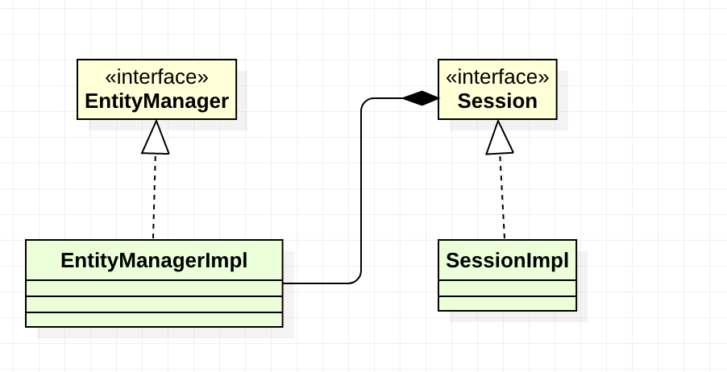
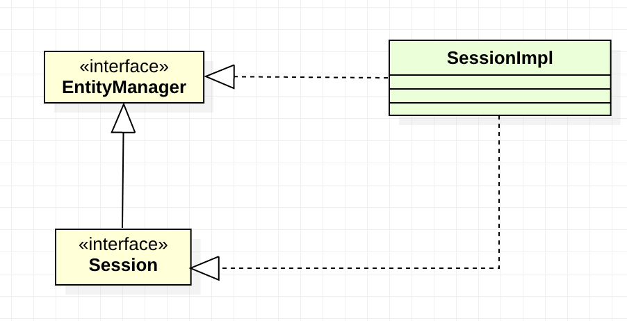
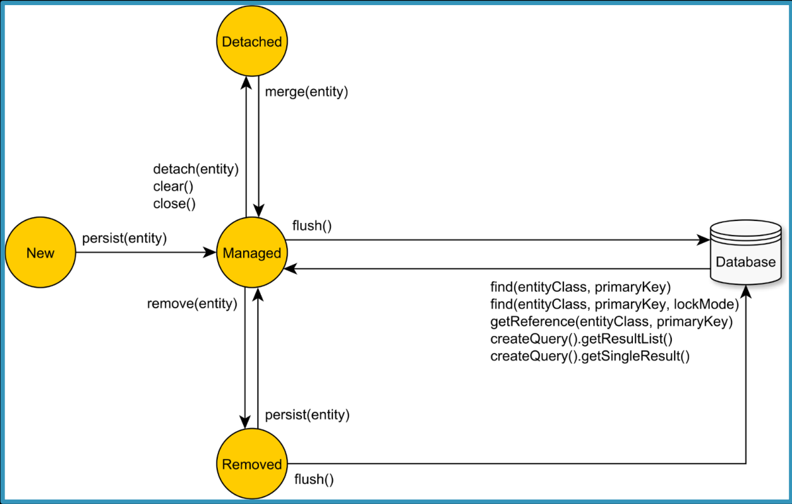
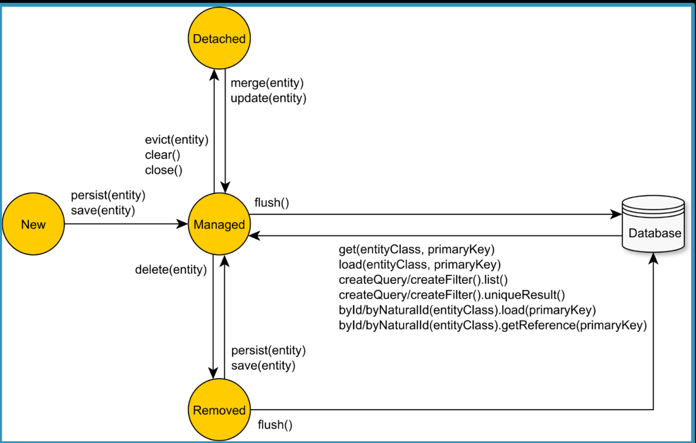

# Persistence Context

The Persistence Context is responsible for managing entities. When you fetch an entity from the database, the entity is associated with the currently running **Persistence Context**. **_You can think of the Persistence Context as a Map where the entity identifier is the key, and the entity Object reference is the value_**.

Once an entity is managed, the Persistence Context can synchronize the entity state changes with the database. 
The Java Persistence API offers the EntityManager interface as a way to interact with the underlying Persistence Context.

Because Hibernate predates JPA, it also offers the Session interface which has the same role as the JPA EntityManager, meaning that you can use the Hibernate Session to interact with the Persistence Context.

Behind the scenes, Hibernate still uses the Session to manage entities,which has been the de facto persistence mechanism even before JPA emerged as a standard. However, as a JPA provider, Hibernate allows you to interact with it via the Java Persistence API classes, like the EntityManager for instance.


#### Prior Hibernate 5.2:



* Prior to Hibernate 5.2, the EntityManager was implemented by the **EntityManagerlmpl** class and was having a reference to the actual Hibernate Session object.

* In turn, the Hibernate Session was implemented by the Sessionlmpl class. 
That being said, it means that in Hibernate 4, 5.0 or 5.1, there is a clear separation between the JPA EntityManager and the Hibernate Session.

* More, if you take a look at the class diagram, you can tell that, from the EntityManager, you can easily get a reference to the Hibernate Session.

That can be done via the unwrap EntityManager method.

```java
EntityManager em;
Session session = em.unwrap(Session.class);
```


#### Since Hibernate 5.2



* Since Hibernate 5.2, the Session interface extends the JPA EntityManager, so there is no indirection layer between these two interfaces.

* Therefore, from 5.2 onwards, the Hibernate Session automatically inherits all methods declared by the JPA EntityManager.


#### First-level cache

* The JPA EntityManager and the Hibernate Session are commonly referred as the first-level cache.
* Every managed entity is stored in a Map, and, once an entity is loaded, any successive request will serve it from the cache, therefore avoiding a database roundtrip.

However, aside from caching entities, the Persistence Context manages entity state transitions.
All JPA entity state transitions are represented by methods exposed by the JPA EntityManager interface.


| Entity state transitions – JPA EntityManager                              | Entity state transitions – Hibernate Session                                          |
| :-----------------------------------------------------------------------: |:-------------------------------------------------------------------------------------:|
|  |  |


---

## Persistence Context Flush

TODO


