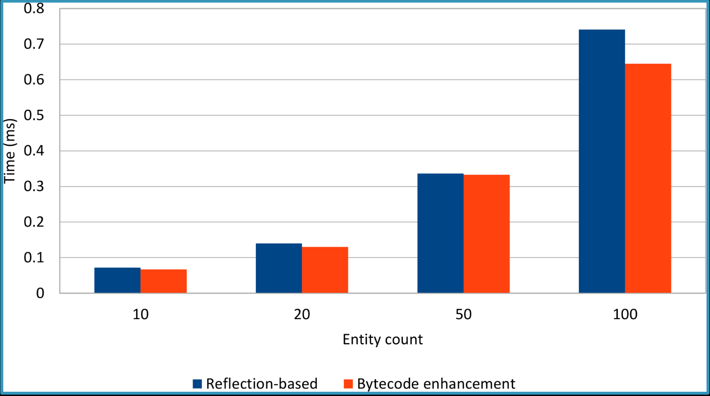

# BYTECODE ENHANCEMENT DIRTY CHECKING

## Agenda
* How to setup the **bytecode enhancement dirty checking**
* How the bytecode enhancement dirty checking mechanism: 
    * How it **Works in practice**
    * What are the **Performance gain** when compared to the default Hibernate dirty checking mechanism.


---

## How to setup the bytecode enhancement dirty checking


```xml
<plugin>
    <groupId>org.hibernate.orm.tooling</groupId>
    <artifactId>hibernate-enhance-maven-plugin</artifactId>
    <version>${hibernate.version}</version>
    <executions>
        <execution>
            <configuration>
                <failOnError>true</failOnError>
                <!-- 
                    the enableDirtyTracking properties  enable the:
                     Bytecode enhancement dirty checking mechanism
                -->
                <enableDirtyTracking>true</enableDirtyTracking>
            </configuration>
            <goals>
                <goal>enhance</goal>
            </goals>
        </execution>
    </executions> 
</plugin>
```

To use the bytecode enhancement dirty checking mechanism, we need to set up the hibernate-enhance plugin, that is offered by the Hibernate Tools project.  

The **enableDirtyTracking** configuration property must be set to true in order to enhance the entit classes with dirty checking capabilities.

We can find example in the **bytecode-enhancement-dirty-checking** module project in the **DirtyCheckingTest**


### Hibernate Default Dirty Checking mechanisms

This test use a Article entity which has an identifier and a name.
The testDirtyChecking unit tests runs two consecutive JPA transactions.

In the first transaction, Article is created and persisted.
And, in the second transaction, a Article entity is fetch and modified. This second transaction execute a flush after the set name of the article instance.


- When calling flush, Hibernate will detect the Article entity modifications and an UPDATE statement will be issued. If we execute the test in debug mode, we can see that, prior to flush, NO Update statement is generated.

- If we one the **org.hibernate.type.TypeHelper** Hibernate internal class and add a break point in the findDirty method, we can see how the default Dirty checking mechanism works.

	1 -  For each entity attribute, the current state is compared to the previous one, which was loaded from the database.
	2 - In our case we can see that the name attribute was 'JPA-with-Hibernate' when the entity was attached to the current Persistence Context, and the current attribute value is 'hibernate-enhance-dirty-checking-mechanism'.
	3 - Because the current and the previous states are different, Hibernate marks the name property in the dirty property array which will be returned to the caller.
	4 - After the flush operation finishes, we can see the UPDATE statement printed in the log. 
	

### Hibernate Bytecode Enhancement Dirty checking mechanisms
    
To see how the Bytecode Enhancement Dirty checking mechanisms works, we need to open the project pom.xml Maven configuration file. 

The hibernate-enhance-maven-plugin is responsible for instrumenting entities classes, and, to enable the dirty checking bytecode enhancement, we need to set the **dirtyTracking** configuration value to **true**.

If we open the Terminal, and run the command:

```bash
mvn clean test-compile 
``` 

We can see that after being compiled, the JPA entities are also enhanced by the Hibernate Tool bytecode instrumentation plugin. In the logger output we can find some thing like the following.

```log
[INFO] --- hibernate-enhance-maven-plugin:5.3.6.Final:enhance (default) @ bytecode-enhancement-dirty-checking ---
[INFO] Starting Hibernate enhancement for classes on /Users/costa/Documents/junk/dummies-projects/hibernate-tunings/bytecode-enhancement-dirty-checking/target/classes
Dec 16, 2018 2:56:31 PM org.hibernate.Version logVersion
INFO: HHH000412: Hibernate Core {5.3.6.Final}
Dec 16, 2018 2:56:31 PM org.hibernate.cfg.Environment <clinit>
INFO: HHH000206: hibernate.properties not found
Dec 16, 2018 2:56:31 PM org.hibernate.bytecode.enhance.internal.bytebuddy.EnhancerImpl doEnhance
INFO: Enhancing [io.costa.hibernatetunings.entities.Article] as Entity
[INFO] Successfully enhanced class [/Users/costa/Documents/junk/dummies-projects/hibernate-tunings/bytecode-enhancement-dirty-checking/target/classes/io/costa/hibernatetunings/entities/Article.class]
[INFO] 
```


To prove that the entity class bytecode has indeed changed, we can go to the Maven target folder and open the Article class.

```java
@Entity
public class Article implements ManagedEntity, SelfDirtinessTracker {
    @Id
    private Integer id;
    private String name;
    @Transient
    private transient EntityEntry $$_hibernate_entityEntryHolder;
    @Transient
    private transient ManagedEntity $$_hibernate_previousManagedEntity;
    @Transient
    private transient ManagedEntity $$_hibernate_nextManagedEntity;
    @Transient
    private transient DirtyTracker $$_hibernate_tracker;
    
    public Article() {
    }
    
    private Article(Integer id, String name) {
        this.$$_hibernate_write_id(id);
        this.$$_hibernate_write_name(name);
    }
    
    public static Article of(Integer id, String name) {
        return new Article(id, name);
    }
    
    public void setName(String name) {
        this.$$_hibernate_write_name(name);
    }
    
    public Integer getId() {
        return this.$$_hibernate_read_id();
    }
    
    public String getName() {
        return this.$$_hibernate_read_name();
    }
    
    public boolean equals(Object o) {
        if (this == o) {
            return true;
        } else if (o != null && this.getClass() == o.getClass()) {
            Article article = (Article)o;
            return Objects.equals(this.getId(), article.getId());
        } else {
            return false;
        }
    }
    
    public int hashCode() {
        return Objects.hash(new Object[]{this.getId()});
    }
    
    public Object $$_hibernate_getEntityInstance() {
        return this;
    }
    
    public EntityEntry $$_hibernate_getEntityEntry() {
        return this.$$_hibernate_entityEntryHolder;
    }
    
    public void $$_hibernate_setEntityEntry(EntityEntry var1) {
        this.$$_hibernate_entityEntryHolder = var1;
    }
    
    public ManagedEntity $$_hibernate_getPreviousManagedEntity() {
        return this.$$_hibernate_previousManagedEntity;
    }

    public void $$_hibernate_setPreviousManagedEntity(ManagedEntity var1) {
        this.$$_hibernate_previousManagedEntity = var1;
    }

    public ManagedEntity $$_hibernate_getNextManagedEntity() {
        return this.$$_hibernate_nextManagedEntity;
    }

    public void $$_hibernate_setNextManagedEntity(ManagedEntity var1) {
        this.$$_hibernate_nextManagedEntity = var1;
    }

    public void $$_hibernate_trackChange(String var1) {
        if (this.$$_hibernate_tracker == null) {
            this.$$_hibernate_tracker = new SimpleFieldTracker();
        }

        this.$$_hibernate_tracker.add(var1);
    }

    public String[] $$_hibernate_getDirtyAttributes() {
        String[] var1 = null;
        var1 = this.$$_hibernate_tracker == null ? new String[0] : this.$$_hibernate_tracker.get();
        return var1;
    }

    public boolean $$_hibernate_hasDirtyAttributes() {
        boolean var1 = false;
        var1 = this.$$_hibernate_tracker != null && !this.$$_hibernate_tracker.isEmpty();
        return var1;
    }

    public void $$_hibernate_clearDirtyAttributes() {
        if (this.$$_hibernate_tracker != null) {
            this.$$_hibernate_tracker.clear();
        }

    }

    public void $$_hibernate_suspendDirtyTracking(boolean var1) {
        if (this.$$_hibernate_tracker == null) {
            this.$$_hibernate_tracker = new SimpleFieldTracker();
        }

        this.$$_hibernate_tracker.suspend(var1);
    }

    public CollectionTracker $$_hibernate_getCollectionTracker() {
        CollectionTracker var1 = null;
        var1 = NoopCollectionTracker.INSTANCE;
        return var1;
    }

    public Integer $$_hibernate_read_id() {
        return this.id;
    }

    public void $$_hibernate_write_id(Integer var1) {
        this.id = var1;
    }

    public String $$_hibernate_read_name() {
        return this.name;
    }

    public void $$_hibernate_write_name(String var1) {
        if (!Objects.deepEquals(var1, this.name)) {
            this.$$_hibernate_trackChange("name");
        }

        this.name = var1;
    }
} 
```

We see that, the Article class bytecode is different that the java class source we saw previously. 

We can find a **DirtyTracker** reference, which is used for managing the entity properties, modifications. 

No only that new fields have been added to the entity class, but all getters and setters have changed as well.

For instance, the setName method does not really assign the associated name field, as ir calls the 'this.$$_hibernate_write_name(name);' method instead.

* Before setting the name attribute, the hibernate_write_name method, that was injected by the the bytecode enhancement mechanism, checks if the current name attribute value is different than the name field of the current Java Object.
* If the name is different, hibernate_write_name will call hibernate_track_change method, which use the DirtyTracker reference to add the "name" attribute to the list of dirty properties.
* All property names are stored in java array which expends automatically with every new property name that is being added.
* The names java array will also be used by the **hasDirtyAttributes** and **getDirtyAttributes** methods which were also injected b the bytecode enhancement mechanism.

* The **hasDirtyAttributes** method is used to check if the dirt properties java array is not empty. And the **getDirtyAttributes** will return the Java array to the caller.


Now we can go the the class **SimpleFieldTracker** that is the default implementation of **DirtyTracker**. We can put a breakpoint in the **add** method and see how the modified properties are added to the names java array. 
We will also add a breakpoint to the **get method of the DirtyTracker** class.
Afterward, we are going to add two breakpoints in our unit test. The first one is for the **setName method call**, and the second one is for flushing the Persistence Context.


* We running the unit test in debug mode we can see that when calling the setName method the DirtyTracker add method is being called to mark that the name entity attribute has changed.

* Before FLUSHING the persistence context, 
** only the fetch entity SELECT statement was executed.


## Dirty Checking Performance Gain

* To validate the bytecode enhancement dirty checking performance gain, the following test measures the dirty tracking time for 10, 20, 50 and 100 Article entity hierarchies (each Article is associated with one ArticleDetails, two ArticleComment and two Tag entities).

* Each iteration modifies six properties: the Post title, the ArticleDetails creation date and owner, the ArticleComment review and the Tag name.





Conclusions:

1. The more entities are associated with the current Persistence Context, the better will be the performance gain of the bytecode enhancement dirty checking mechanism over the Hibernate default one.

2. for at least 100 entities the bytecode enhancement dirty tracking mechanism is faster than the default Hibernate default dirty checking implementation.

3. Although the  bytecode enhancement dirty tracking mechanism can speed up the Persistence Context flush operation. If the size of the Persistence Context is small, the improvement is no significant.

4. When using the byte code dirty checking the loading-time entity snapshot is still saved in the current Persistence Context because the hydratedState might be used for the second-level cache entries.