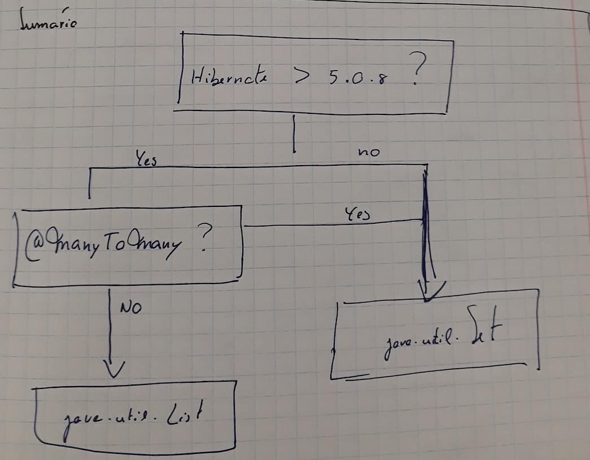

# Hibernate ToMany How to choice the right collection type

- Jpa and Hibernate using the following collections APIs:
  - List
  - Set
  - Bag
    
#### List and Bag

- Both are implementations of the interface `java.util.List`
- The difference is that List is ordered, while Bag is unordered
- In any ToMany mapping if the order is not specified, Hibernate will use a `Bag`
- Note:
   - You can define the ORDER BY clause with JPA’s @OrderBy annotation. If you don’t provide any additional information, Hibernate will order the associated entities by their primary key  If you want to retrieve them in a different order, you can define an orderby_list with one or more orderby_items as follows:
       ```
         @ManyToMany(mappedBy = "authors")
         @OrderBy("title ASC")
         private List<Book> books = new ArrayList<Book>();
       ```
     
### Should you use a Bag or a Set?

- the answer seems to be easy.
- In general, a java.util.List provides the better performance while a java.util.Set doesn’t contain any duplicates.
- As long as you implement the create use case correctly, a java.util.List seems like the obvious best choice for your association mapping.
- But it’s not that easy. A List might be more efficient than a Set, but the type also influences how Hibernate manages the association in the database. So, there are a few other things you need to take into account when you make your decision.

### A critical bug in older Hibernate versions
- First of all, if you’re using a Hibernate version older than 5.0.8, you should be aware of bug [HHH-5855](https://hibernate.atlassian.net/browse/HHH-5855). 
- When you used a java.util.List and merged the parent entity, Hibernate generated 2 INSERT statements for each new child entity.
 
### Inefficient handling of many-to-many associations

- When you’re mapping a many-to-many association, you should always use a `java.util.Set`.
- Don’t use a List for many-to-many associations

- If we need to use a List, Hibernate will be inefficient.
- If we need to remove only one record, hibernate will remove all records and insert them all again except the record to be removed.
  
## In Summary:


