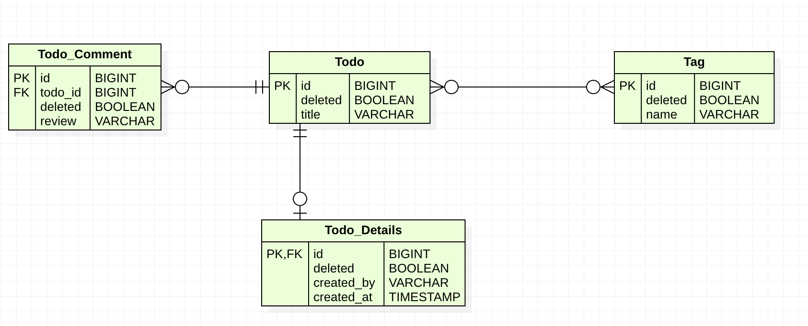

# How to implement a soft delete with Hibernate


What is a soft delete?
A soft delete performs an update to mark a record as deleted instead of removing it from the database table. Common ways to model a soft delete are:

* a **boolean** that indicates if the record is active or deleted,
* an **Enumerated** which models the state of the record,
* a **timestamp** that stores the date and time when the soft delete was performed.


## How to implement a soft delete with Hibernate
It’s not that difficult to implement a soft delete with Hibernate. You just have to:

tell Hibernate to perform a SQL UPDATE instead of a DELETE operation and
exclude all “deleted” records from your query results.
I’ll show you how you can easily do that in this post. All examples will use the following Account entity which uses the AccountState enum to indicate if an account is INACTIVE, ACTIVE or DELETED.

```java
@Entity
@NamedQuery(name = "Account.FindByName", query = "SELECT a FROM Account a WHERE name like :name")
public class Account {

	@Id
	@GeneratedValue(strategy = GenerationType.AUTO)
	@Column(name = "id", updatable = false, nullable = false)
	private Long id;

	@Column
	private String name;

	@Column
	@Enumerated(EnumType.STRING)
	private AccountState state;

}
```

Update the record instead of deleting it
To implement a soft delete, you need to override Hibernate’s default remove operation. You can do that with an @SQLDelete annotation. This annotation allows you to define a custom, native SQL query that Hibernate will execute when you delete the entity. You can see an example of it in the following code snippet.

```java
@Entity
@SQLDelete(sql = "UPDATE account SET state = 'DELETED' WHERE id = ?", check = ResultCheckStyle.COUNT)
public class Account { }
```


The @SQLDelete annotation in the previous code snippet tells Hibernate to execute the given SQL UPDATE statement instead of the default SQL DELETE statement. It changes the state of the account to DELETED and you can use the state property in all queries to exclude the deleted accounts.


```
Account a = em.find(Account.class, a.getId());
em.remove(a);
```


## Examples

In this example we are using the following described Domain Model.

Considering we have the following tables in your database:



As you can see in the diagram above, the **Todo**, **Todo_details**, **Todo_comment**, and **Tag** tables contain a deleted column which dictates the visibility of a given row. 
What’s interesting about this database table model is that it covers all three database relationship types:

* one-to-one
* one-to-many
* many-to-many
