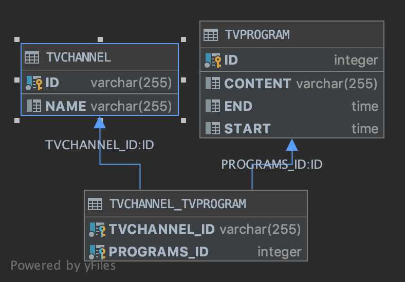
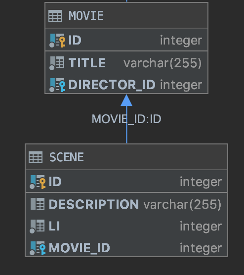

# Relationships

- Many to One

- One to Many

- Many to Many

- Element Collection


##  Many to One 

```java
@Entity
public class Movie {
    @Id
    private Integer id;
    @Column(name = "title", nullable = false)
    private String title;
    
    // By default the fetch value is FetchType.EAGER, 
    // changing the behavior of fetch to LAZY is a great improvement, 
    // even by it is always possible to change this behavior at query execution time (using a graph or a fetch). 
    // The opposite is not possible
    @ManyToOne(fetch = FetchType.LAZY) 
    @JoinColumn(name = "director_id", referencedColumnName = "id", nullable = false)
    private Director director;
}
```


## One to Many 


### Bidirectional

In a bidirectional association, only one side can control the underlying table relationship. For
the bidirectional `@OneToMany` mapping, it is the child-side `@ManyToOne` association in charge of
keeping the foreign key column value in sync with the in-memory `Persistence Context`. This
is the reason why the bidirectional @OneToMany relationship must define the mappedBy attribute,
indicating that it only mirrors the @ManyToOne child-side mapping.

One of the major advantages of using a bidirectional association is that entity state transitions
can be cascaded from the parent entity to its children. In the following example, when
persisting the parent Post entity, all the PostComment child entities are persisted as well.


```java
@Entity
public class Movie {
    @Id private Integer id;
    
    @Column(name = "title", nullable = false)
    private String title;
    
    @OneToMany(
            mappedBy = "movie",
            cascade = CascadeType.ALL,
            orphanRemoval = true
    )
    Set<Review> reviews = new HashSet<>();
        
    public void addReview(Review review) {
        this.reviews.add(review);
        review.setMovie(this);
    }
    
    public void removeReview(Review review) {
        reviews.remove(review);
        review.setMovie(null);
    }
}
  
  
@Entity
public class Review {
    @Id private Integer id;
   
    private String comment;
   
    @ManyToOne
    @JoinColumn(
            name = "movie_id",
            updatable = false,
            nullable = false
    )
    private Movie movie;
    
    void setMovie(final Movie movie) {
        this.movie = movie;
    }
}
```

### Unidirectional 


The unidirectional `@OneToMany` association is very tempting because the mapping is simpler than its bidirectional counterpart. 
Because there is only one side to take into consideration, there is no need for helper methods and the mapping does not feature a mappedBy attribute either

####  Unidirectional with 3 tables

It is less efficient than the unidirectional `@ManyToOne` mapping or the bidirectional `@OneToMany` association. 
This **Unidirectional @OneToMany association does not map to a `one-to-many` table relationship**. 
Because there is no `@ManyToOne` side to control this relationship, Hibernate uses a separate junction table to manage the association between a parent row and its child records.

```java
@Entity
public class TvChannel {

    @Id
    private String id;
    private String name;

    @OneToMany(cascade = CascadeType.ALL, orphanRemoval = true)
    private Set<TvProgram> programs = new HashSet<>();

    public void addProgram(TvProgram tvProgram) {
        this.programs.add(tvProgram);
    }

    public void removeProgram(TvProgram tvProgram) {
        this.programs.remove(tvProgram);
    }
}

@Entity
public class TvProgram {
    @Id
    @GeneratedValue(
            strategy = GenerationType.SEQUENCE, 
            generator = "tv_program_seq") // this will with JPA 2.2 will generate a sequence named 'tv_program_seq' with with default value defined in the @SequenceGenerator annotation
    private Integer id;
    
    private LocalTime start;

    private LocalTime end;

    private String content;
}
```

The previous Entities configuration will generate 3 tables:




#### Unidirectional with @JoinColumn

The next Entities configuration will generate 2 tables, it is the best option in terms of complexity.


```java
@Entity 
public class Movie {
    
        @OneToMany(
                fetch = FetchType.LAZY, 
                cascade = CascadeType.ALL, 
                orphanRemoval = true)
        @JoinColumn(name = "movie_id", 
                    updatable = false, 
                    nullable = false)
        //@OrderColumn()
        @OrderBy("li asc ")
        List<Scene> scenes = new ArrayList<>();
}
  
@Entity
public class Scene {
    @Id
    @GeneratedValue(
            strategy = GenerationType.SEQUENCE, 
            generator = "scene_id_generator")
    @SequenceGenerator(
            name="scene_id_generator", 
            sequenceName = "scene_seq", 
            initialValue = 1,
            allocationSize = 10)
    private Integer id;

    private int li = 0;
}
```




IMPORTANT NOTE:

**Bidirectional `@OneToMany` with `@JoinColumn` relationship**

The @OneToMany with @JoinColumn association can also be turned into a bidirectional relationship, but it requires instructing the child-side to avoid any insert and update synchronization:

```java

class Scene {
    ...   

    @ManyToOne
    @JoinColumn(name = "movie_id", insertable = false, updatable = false)
    private Movie movie;
}
```

The redundant update statements are generated for both the unidirectional and the bidirectional association, so the most efficient foreign key mapping is the @ManyToOne association.


## Element Collection

```java
@Entity
public class Actor {

    @Id
    private Integer id;

    @ElementCollection(
            fetch = FetchType.LAZY)
    @JoinTable(
            name = "actor_language",
            joinColumns = { @JoinColumn(name = "actor_id", nullable = false) })
    @Enumerated(EnumType.STRING)
    @Column(name = "language", nullable = false)
    private Set<Language> languages = new HashSet<>();
    
    
    @ElementCollection(fetch = FetchType.LAZY)
    @CollectionTable(
                name = "actor_prize",
                joinColumns = @JoinColumn(name = "actor_id", nullable = false, updatable = false))
    @AttributeOverrides({
                @AttributeOverride(name = "at", column = @Column(name = "recived_at", nullable = false, updatable = false)),
                @AttributeOverride(name = "value", column = @Column(name = "prize_value", nullable = false, updatable = false))
    })
    private Set<Prize> prizes = new HashSet<>();
}

@Embeddable
public class Prize implements Serializable {

    private OffsetDateTime at;
    private BigDecimal value;
}
```

We can also use a Map

```java
@Entity
public class TvSerie {

    @Id
    private Integer id;

    @ElementCollection(fetch = FetchType.LAZY)
    @CollectionTable(name = "tv_serie_episode", joinColumns = @JoinColumn(name =     "tv_serie_id"))
    @MapKeyColumn(name = "field_key", length = 50)
    @Column(name = "field_value", length = 100)
   // @BatchSize(size = 20)
    private Map<String, String> episodes = new HashMap<>();
    
    @ElementCollection(fetch = FetchType.LAZY)
    @CollectionTable(name = "tv_serie_prize", joinColumns = @JoinColumn(name = "tv_serie_id"))
    //@MapKeyEnumerated(EnumType.STRING)
    @MapKeyColumn(name = "field_key", length = 50)
    @AttributeOverrides({
            @AttributeOverride(name = "at", column = @Column(name = "recived_at", nullable = false, updatable = false)),
            @AttributeOverride(name = "value", column = @Column(name = "prize_value", nullable = false, updatable = false))
    })
    private Map<String, Prize> prizes = new HashMap<>();
}
```